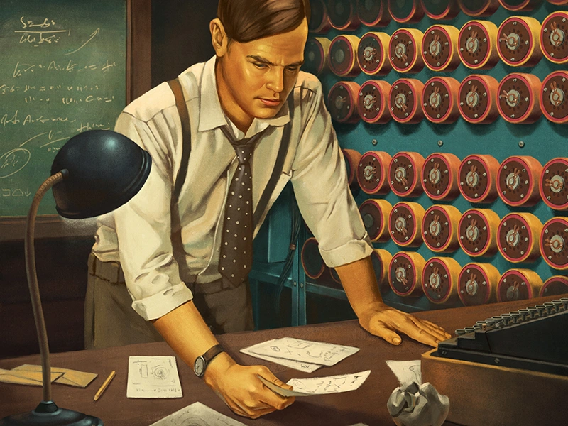
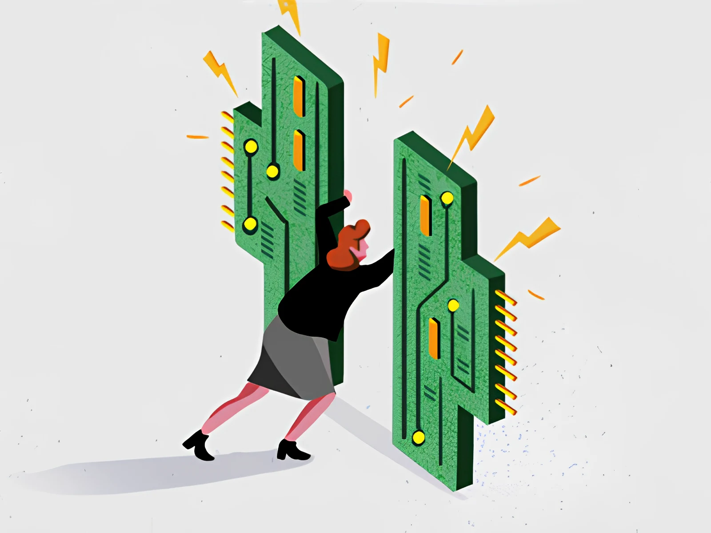
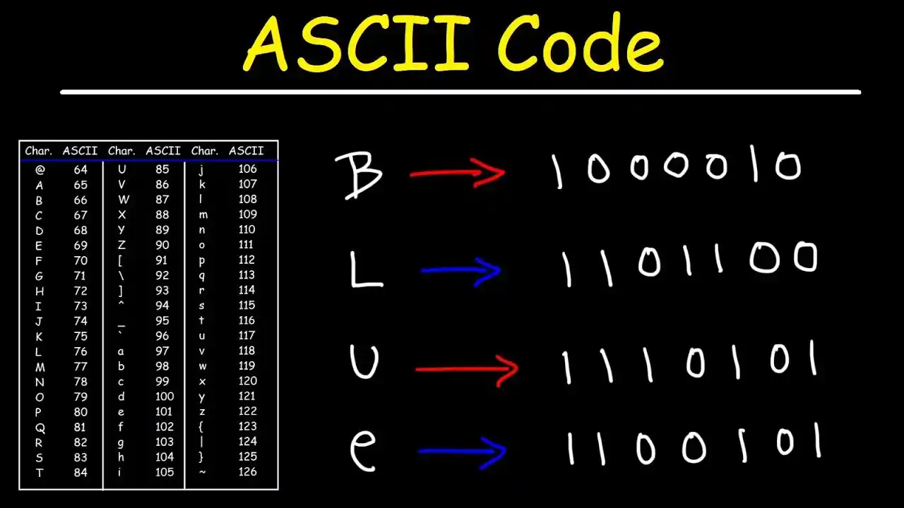

# Başlangıç: Bilgisayarlar ve Programlama Üzerine Eğlenceli Bir Yolculuk 🚀

Merak etmeyin, sizi hemen derin teknik detaylara boğmadan önce bilgisayarlar ve programlama dünyasına kısa bir giriş yapalım. Bu yazı, sistemin nasıl çalıştığını anlamanız için keyifli ve bilgilendirici bir başlangıç olacak. İsterseniz, doğrudan son bölüme geçip IDE'nizi kurduktan sonra ilk derse başlayabilirsiniz. Ama öncesinde, bu kısa girişi okumanızı öneririm.

## Kullanıcı ve Bilgisayar: Birbirimizi Anlamak

Bilgisayarlar, aslında basit bir prensibe dayanır: veri işleme. Bu işleme, elektronik bileşenler (en önemlisi transistörler) aracılığıyla gerçekleşir. Transistörler, işlemcilerin yapıtaşıdır ve bilgisayarın beyni gibidir, verileri işleyerek bilgisayarın ne yapacağını belirler. İşte bu basit prensip, muhteşem işler başarmamızı sağlar.

## Transistörler: Elektronik Dünyanın Yapı Taşları

Transistörler, elektrik akımını kontrol ederek çalışır. Bu minik elektronik bileşenler, bir tür "anahtar" gibi davranır ve bilgisayarın temel mantık işlemlerini (AND, OR, NOT gibi) yapmasına olanak tanır. Transistörler ve onların oluşturduğu mantıksal kapılar sayesinde, bilgisayarlar karmaşık hesaplamalar yapabilir. Transistörlerin iletimlerinin açık veya kapalı olmasına göre <code> 0 ve 1</code> oluşur.

## Programlama: İnsan ve Makine Arasındaki Köprü

Programlama dilleri, biz insanların bilgisayarlarla iletişim kurmasını sağlayan sihirli bir araçtır. `Python` gibi yüksek seviyeli dillerden, bilgisayarın anlayabileceği `makine kodu`na kadar bir dizi dil vardır.En düşük seviye, makine kodudur; bu, bilgisayarın doğrudan anlayabildiği ve işleyebildiği, 0’lar ve 1’lerden oluşan bir dildir. Her bir 0 veya 1, bir transistörün açık veya kapalı durumunu temsil eder.Bu diller, yazdığınız programları bilgisayarın anlayıp çalıştırabileceği dillere dönüştürür. Ve işte bu dönüşüm süreci, derleme olarak bilinir.Derlenmiş makine kodu, işlemci tarafından doğrudan yürütülebilir. İşlemci, bu kodu okuyarak transistörlerin ne zaman açılıp kapanacağını belirler, bu da bilgisayarın belirli görevleri yerine getirmesini sağlar.

# 0 ve 1'lerin Büyülü Dünyası

Makine kodu, basit 0'lar ve 1'lerden ibaret olup, bilgisayarın anlayıp işleyebileceği dildir. Bu kodlar, çeşitli çıktılar üreterek bilgisayarın sizin için çalışmasını sağlar. İşte bu çıktılar, metinler, resimler, programlar ve daha fazlası olabilir. Evet şuan ekranda gördüğünüz görüntü dahi 0 ve 1'lerden oluşuyor. Tıpkı evrenin atomlardan (proton ve elektron) oluşması gibi. 

## Makine Kodundan Anlaşılır Dile

Bilgisayarların işlemcileri, makine kodunu direkt olarak çalıştırır. Ancak, yüksek seviyeli dillerde yazılan programlar, bu kodlara "çevrilir". Bu dönüşüm sayesinde, programlar bilgisayarlar tarafından anlaşılır ve çalıştırılabilir hale gelir.

## Veriler ve Abstraksiyon

Programlar, çeşitli veri yapıları ile çalışır. Bu yapılar, sayılardan metinlere, resimlere kadar her şey olabilir. Programlama dilleri, bu verileri işlememizi kolaylaştıran araçlar sunar. Örneğin, bir resim aslında bellekte bir sayı dizisi olarak saklanır.

## Çıktıların Sihiri

Bilgisayarlar, verileri işleyerek çeşitli çıktılar üretebilir: metin belgeleri, grafikler, sesler, videolar... Bu süreçler, bilgisayarların nasıl karmaşık işlemleri gerçekleştirdiğinin ve verileri nasıl görselleştirdiğinin temelidir. Örneğin bu yazıda okuduğunuz karakterler bilgisayar sisteminde ASCII karakterleri ile oluşturuluyor. 

## Kullanıcı Arayüzleri: Etkileşimin Kapısı

Kullanıcı arayüzleri, kullanıcıların programlarla etkileşim kurmasını sağlar ve bu etkileşimler sonucunda makine kodu yürütülür. Kullanıcı arayüzleri, metin tabanlı (örneğin, komut satırı arayüzleri) veya grafik tabanlı (Grafik Kullanıcı Arayüzleri, GUI’ler) olabilir. Kullanıcı girdileri (örneğin, fare tıklamaları veya klavye girdileri), programın işleyeceği verilere dönüştürülür ve bu, belirli çıktıların üretilmesine yol açar.

Bu süreçlerin tümü, bilgisayarların çok çeşitli görevleri gerçekleştirebilmesini sağlar. Temelde basit olan makine kodu, karmaşık yazılımların ve kullanıcı dostu arayüzlerin temelini oluşturur. Bu dönüşüm mekanizmaları sayesinde, bilgisayarlar geniş bir yelpazede veri işleme ve görselleştirme yeteneklerine sahiptir.

Bu eğlenceli ve bilgilendirici yolculuk sayesinde, bilgisayarların ve programlamanın temellerini anlamaya başladınız. Basit 0'lar ve 1'lerle başlayan bu macera, sizin yaratıcılığınızla sınırları aşan bir dünyaya açılan kapıdır.

# Gerekli Çalışma Ortamının Sağlanması 

Temel seviye için hiçbir ide kurulumu yapmayacağız. Tüm programlama işlemleri için ücretsiz online bir ide olan replit'i kullanacağız.
Proje ve ödevlerin çözümlerinide replit üzerinden sağlayacağım. 


Replit'e üye ol


---

# Seri Takibi 

Bu yazının üst ve alt bölümünde de gördüğünüz üzere bir seri yapısı oluşturdum. Bu sayede dersler arasında hızlı ve kolay bir geçiş yapabilirsiniz.
Dilerseniz ilk dersimize başlayalım.