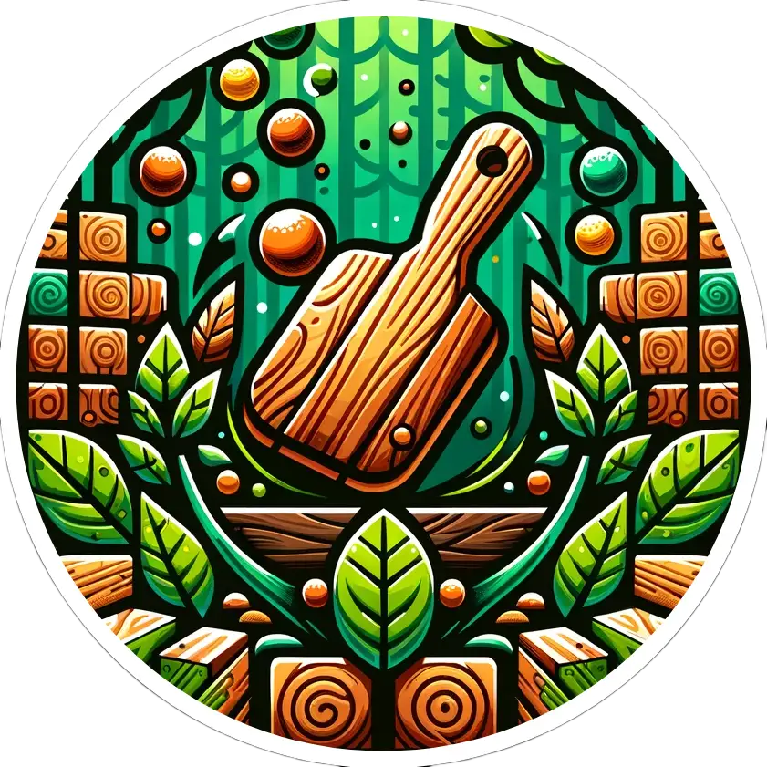

# Python Projects

<table>
    <thead>
        <tr>
            <th></th>
            <th>Project Name</th>
            <th>Description</th>
            <th>Link</th>
        </tr>
    </thead>
    <tbody>
         <tr>
            <td></td>
            <td> ToDo App (Web Development, GUI)</td>
            <td>FlaskToDo is an intuitive web-based todo list application that simplifies task management and boosts productivity.</td>
            <td><a target="_blank" href="https://github.com/emrecengdev/ToDoList-Python-Flask">github</a></td>
        </tr>
         <tr>
            <td></td>
            <td>TicTacToe (Scripting, Game)</td>
            <td>A simple, text-based TicTacToe game in Python allowing two players to compete in the classic game through a command-line interface.</td>
            <td><a target="_blank" href="https://github.com/emrecengdev/TicTacToe-python">github</a></td>
        </tr>
           <tr>
            <td></td>
            <td>Breakout Game (GUI, Game)</td>
            <td>A simple, text-based TicTacToe game in Python allowing two players to compete in the classic game through a command-line interface.</td>
            <td><a target="_blank" href="https://github.com/emrecengdev/TicTacToe-python">github</a></td>
        </tr>
    </tbody>
</table>